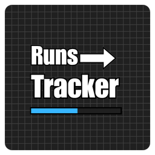

# Runs Tracker



A Geometry Dash mod built using the [Geode SDK](https://geode-sdk.org/) that automatically tracks and analyzes your runs in both Normal and Practice modes.

## Features
* **Automated Run Tracking**: Silently records your start and end percentages for every attempt in both Normal and Practice modes.
* **Absolute Percentage Calculation**: Calculates your absolute progress using player coordinates, ensuring accurate tracking even when spawning on a *Start Pos* object.
* **Optimal Runs Algorithm**: Analyzes your recorded runs to calculate the theoretical minimum sequence of segments needed to complete the level from 0% to 100%.
* **Editor Level Linking**: Merge statistics from local editor copies directly with the main online level for unified progression tracking.
* **Clean, Paginated UI**: Easily navigate your local levels with an optimized pagination interface (6 items per page, sorted from newest to oldest).

## Installation
You can install this mod directly from the in-game **Geode Mod Index** by searching for **"Runs Tracker"**.

Alternatively, you can manually install it:
1. Download the latest `.geode` file from the [Releases](https://github.com/tonnerregamer/runs-tracker/releases) page.
2. Place the `.geode` file into your Geometry Dash `geode/mods` directory.

## Build Instructions
If you wish to compile the mod yourself, make sure you have the [Geode CLI](https://github.com/geode-sdk/cli) set up:

```sh
geode package
# Assuming you have the Geode CLI set up already
geode build
```

# Resources
* [Geode SDK Documentation](https://docs.geode-sdk.org/)
* [Geode SDK Source Code](https://github.com/geode-sdk/geode/)
* [Geode CLI](https://github.com/geode-sdk/cli)
* [Bindings](https://github.com/geode-sdk/bindings/)
* [Dev Tools](https://github.com/geode-sdk/DevTools)
